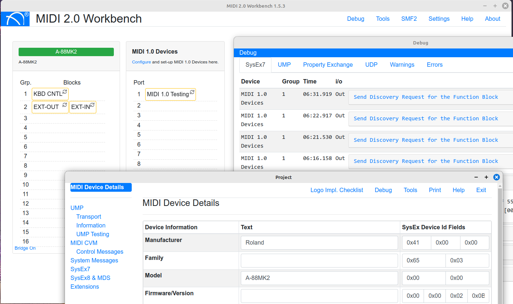

# MIDI 2.0 Workbench


The MIDI 2.0 Workbench is a free tool from MIDI Association Members to help developers develop, debug (and deploy) MIDI 2.0 Applications and Devices. It runs on Windows, Mac and Linux.
The Workbench connects to your device or software, to test various MIDI 2.0 implementation features against the currently released specifications.

It provides a comprehensive debug of: 
* UMP messages
  * Stream Messages
  * Channel Voice Messages
  * System Messages
  * Utility Messages
  * System Exclusive
* MIDI-CI v1.1 and 1.2
  * Discovery
  * Property Exchange
  * Profiles
  * Process Inquiry
  * Protocol Negotiation (1.1. only)
* Standard MIDI File 2 - Processor and validator

The MIDI 2.0 Workbench also test various UMP transports where possible.

To test USB MIDI 2.0 please make sure you use either:
* OSX 14+
* Linux with a 6.5+ Kernel and ALSA libs 1.2.10+

Some prior version may work with mixed results.


This project uses a lot of raw data, as such it may not use available OS API's. It is recommended to use OS API's where 
available, and this project should not been seen as reference code.

### How To Build this Project
-----------------------
Use version 16.x of NodeJS. Later versions have issues with the C++ plugins.
On Mac please make sure the Xcode command line tools are installed.

After you cloned this repository
please run:
```
yarn
yarn run build
```
To run the application:
```
yarn run start
```

#### Installation FAQ's
_Q: Why are there no binary releases?_<br/>
A: This will happen eventually. Once code-signing is set up and working this will occur.

_Q: Later Ubuntu distro's don't support Node 16. How do I get it work?_<br/>
A: Use yarnpkg and nvm
```
curl -o- https://raw.githubusercontent.com/nvm-sh/nvm/v0.39.7/install.sh | bash
nvm install 16
nvm use 16
git clone https://github.com/midi2-dev/MIDI2.0Workbench.git
cd MIDI2.0Workbench
sudo apt-get install yarnpkg libasound2-dev
yarnpkg
yarnpkg run build
yarnpkg run start
```
If you have issues with running electron then the following commands may help:
```
node_modules/electron/dist $ sudo chown root:root chrome-sandbox
node_modules/electron/dist $ sudo chmod 4755 chrome-sandbox
```

#### Issues and Updates
-----------------
This Project aims to follow the current public MIDI specifications. 
Please use the GitHub Issues to log any bugs, suggestions etc. 

This project is supported and copyrighted by Yamaha Corporation 2020 under MIT. 

## Midi2Swift — Static Swift MIDI 2.0 Library

This repo also contains a static-only Swift library generated from the Workbench source (no runtime coupling). The pipeline extracts protocol facts from the JS/TS sources, writes a canonical JSON contract, then generates fully implemented Swift types and tests.

- Modules: `Core` (bit helpers, UMP containers), `UMP` (generated message types), `CI` (MIDI-CI reducers)
- Containers: `UMP32`, `UMP64`, `UMP128`
- Generation outputs: `swift/Midi2Swift/Sources/UMP/Generated/*.swift`
- Golden vectors: `vectors/golden/*.json`

Quick start:
- One-liner (full pipeline): `npm run swift:all`
  - Runs extractor, Swift codegen, test generation, profiles/PE catalogs, verification, then Swift build and tests.
- Or step-by-step:
  - Generate contract and vectors: `node scripts/extract-static.js`
  - Generate Swift: `node scripts/codegen-swift.js`
  - Generate tests: `node scripts/codegen-swift-tests.js`
  - Generate Profiles/PE catalogs: `node scripts/codegen-profiles.js`
  - Verify: `node scripts/verify-contract.js`
  - Build and test: `cd swift/Midi2Swift && swift build && swift test`

If you encounter module cache permission issues with SwiftPM, use a local module cache:

```
cd swift/Midi2Swift
export CLANG_MODULE_CACHE_PATH=$(pwd)/.clangModuleCache
mkdir -p .clangModuleCache
swift build
swift test
```

Usage example (MIDI 2.0 CV Note On):

```
import UMP

let note = MIDI20ChannelVoiceMessagesNoteOn(
  group: 0, channel: 0, notenumber: 60, attributetype: 0, velocity: 0x1234, attribute: 0
)
let packet = note.encode()   // UMP64
let round = MIDI20ChannelVoiceMessagesNoteOn.decode(packet)
```

MIDI-CI reducers:

```
import CI

var s = CIState()
(s, _) = reduce(s, .start)
(s, _) = reduce(s, .reply)
// s.status == .completed
```

CI workflow (`.github/workflows/ci.yml`) runs extractor, codegen, verification, and Swift tests on macOS.
